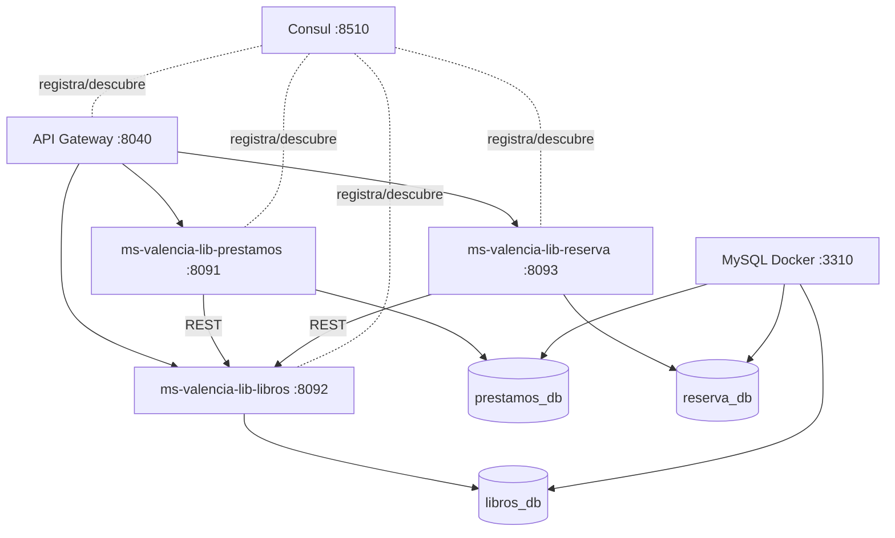

# Arquitectura y despliegue

## Microservicios

## Comunicaciones REST

- `ms-valencia-lib-prestamos -> ms-valencia-lib-libros`
  - Verifica libro.
  - Valida stock.
  - Disminuye stock al prestar.
  - Aumenta stock al devolver.

- `ms-valencia-lib-reserva -> ms-valencia-lib-libros`
  - Verifica libro.
  - Valida disponibilidad.

## Bases de datos

- `libros_db`: `categoria`, `autor`, `libro`.
- `prestamos_db`: `prestamo`, `detalle_prestamo`, `devolucion`.
- `reserva_db`: `reserva`, `historial_reserva`.
